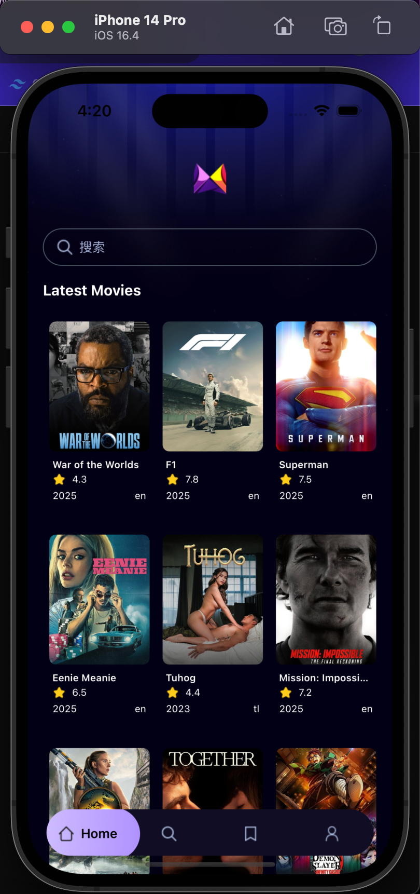
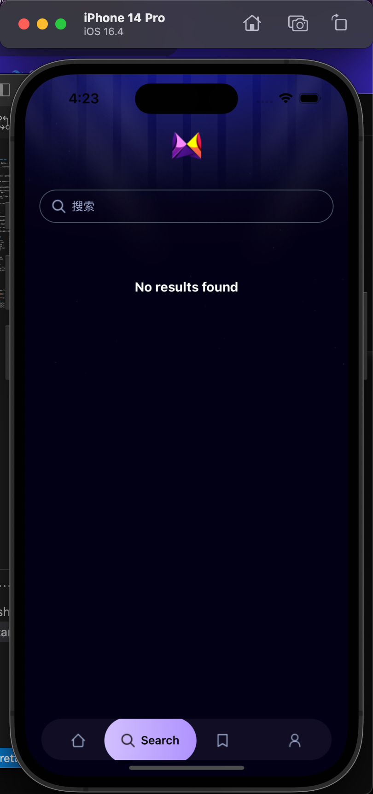
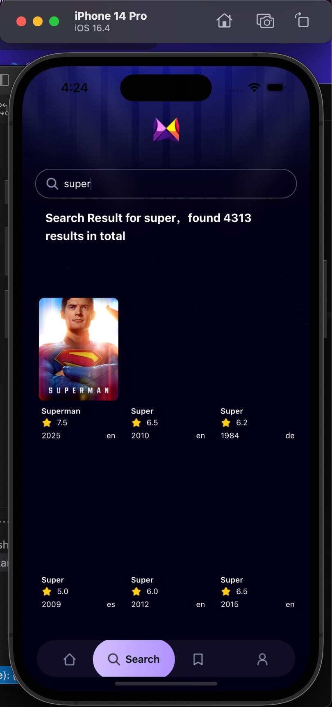

### 🎬 Movie Demo App

一个使用 React Native + Expo + TypeScript + Tailwind CSS 开发的电影类 Demo 应用。
应用包含电影排行榜、详情页、搜索页等功能，同时预留了个人中心和收藏页面。

### 🚀 技术栈

React Native
 – 跨平台移动应用开发框架

Expo(V53)
 – React Native 工具链，支持快速开发和部署

TypeScript
 – 提供类型支持，提升代码可维护性

Tailwind CSS (NativeWind)
 – 快速构建 UI 样式

React Navigation / Expo Router
 – 应用路由与导航

Fetch
 – 请求第三方电影数据 API

Zustand
 – 状态管理

### 📱 功能特性

🎥 排行榜页：展示热门/最新电影

🔍 搜索页：支持关键字搜索电影

📖 详情页：查看电影详情、简介、评分等信息

👤 个人中心（待完善）

💾 收藏页面（待完善，计划用于保存用户喜欢的电影）


###  📂 项目结构
```
├── app/                # 页面文件（expo-router）
├── (tabs)/             # Tab 页面
│   ├── (_layout.tsx)   # Tab 页面布局
│   ├── index.tsx       # 排行榜页
│   ├── search.tsx      # 搜索页
│   ├── save.tsx        # 收藏页（待开发）
│   ├── profile.tsx     # 个人中心（待开发）
├── movie/              # 模块化电影数据
│   ├── [id].tsx        # 详情页               # 电影数据接口
├── components/         # 公共组件（电影卡片、搜索框等）
├── constants/          # 静态资源、图标、图片等
├── store/              # 状态管理（Zustand）
├── utils/              # 工具函数
├── package.json
├── tsconfig.json
└── README.md
```

###  ⚡ 快速开始
1. 克隆项目
```
git clone https://gitee.com/huangrui47/react-native-movie.git
cd react-native-movie
```

2. 安装依赖
```
npm install
# 或者
yarn install 
```

3. 启动项目
```
npx expo start 
```

### 🔗项目依赖
[接口数据](https://www.themoviedb.org/settings/api)

[YouTube教学视频]( https://www.youtube.com/watch?v=BTfcnxXevm0)

[原作者GitHub仓库]( https://github.com/adrianhajdin/react-native-movie-app)

### 🖼️页面截图




